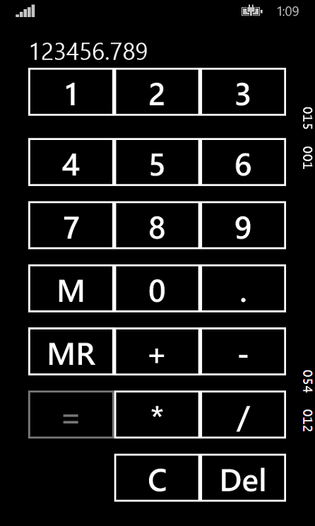
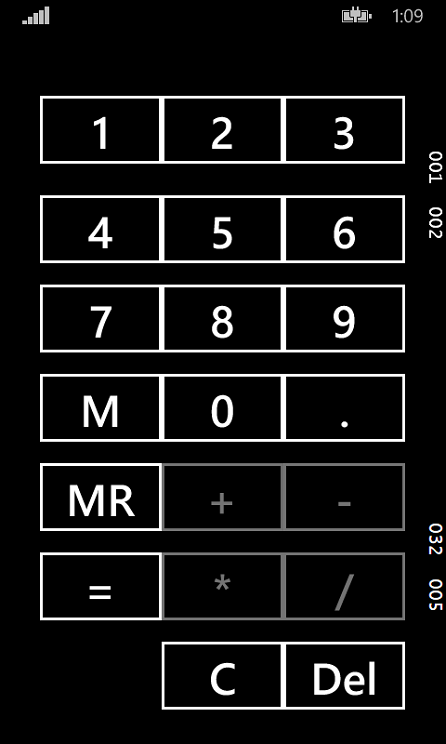
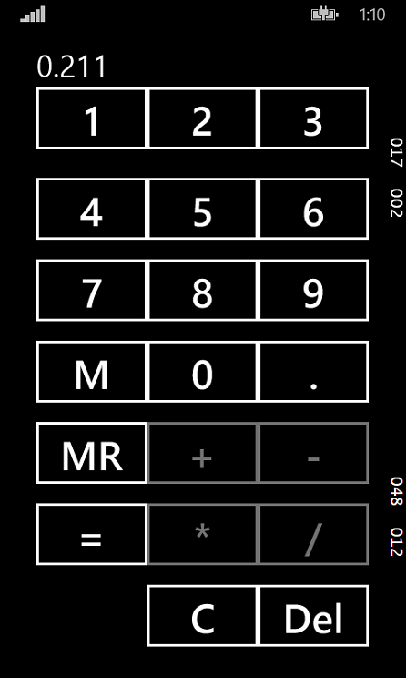
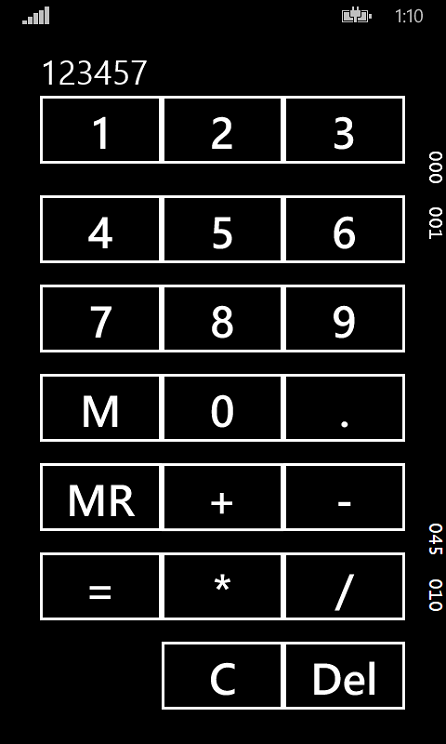
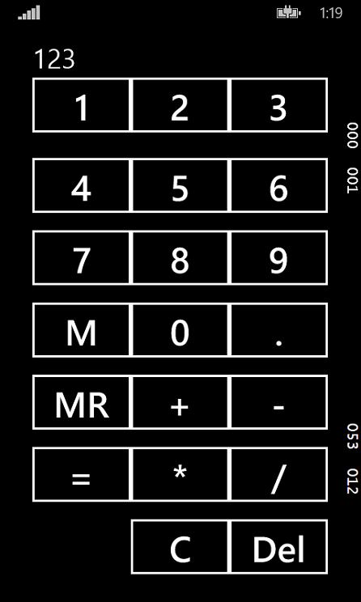

## What is it
Calculator is a Windows Phone application that allows you to provide all general mathematic operations on the numbers.

## How it works
Consider a simple use case.
### Input `a` value.
Tap to the buttons to write the number `a`.

### Choose the operation
Choose the operation you want to apply. For example, `Plus` button.

### Input `b` value.
Tap to the buttons to write the number `b`.

### Get result
Tap the `Eq` button to see the result of the operation. In out example it is `a + b` operation result will be shown:)

### Usage memory buttons
To save the result to the memory tap the `M` button. Now you can use `MR` button to return saved value from the memory.

### Clear or delete
To clear the whole text field or the last symbol of the number tap the `C` button or the `Del` button respectively.

## Where it works
It should be work on all Windows Phone 8.1 devices.

## How it developed
Windows Phone 8.1 app has been created in Visual Studio 2013.
