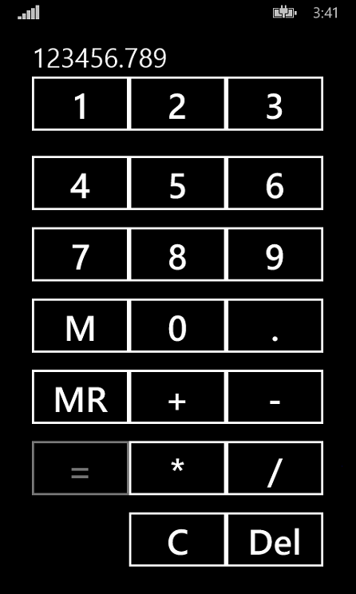

## What is it
Calculator is a Windows Phone application that allows you to provide all general mathematic operations on the numbers.

## How it works
Simple look at the screenshot:)

## Where it works
It should be work on all Windows Phone 8.1 devices.

## How it developed
Windows Phone 8.1 app has been created in Visual Studio 2013.
